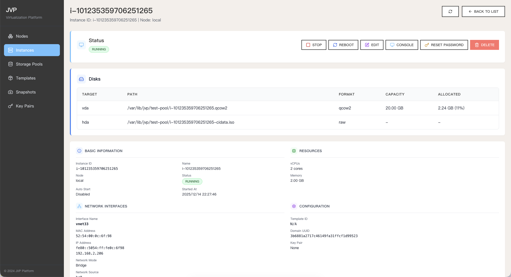
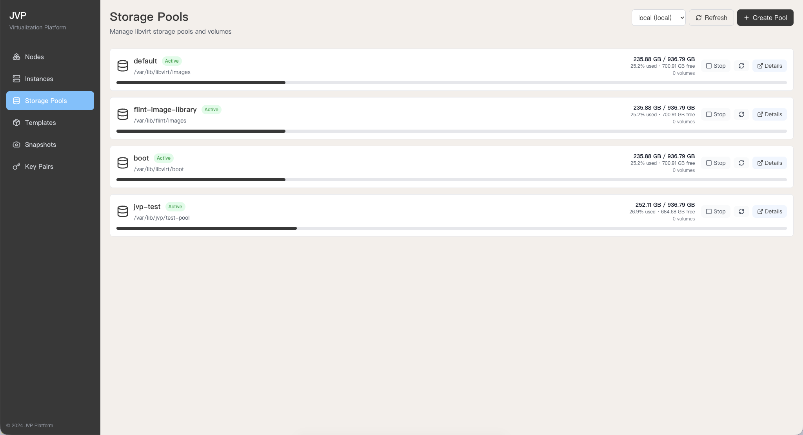
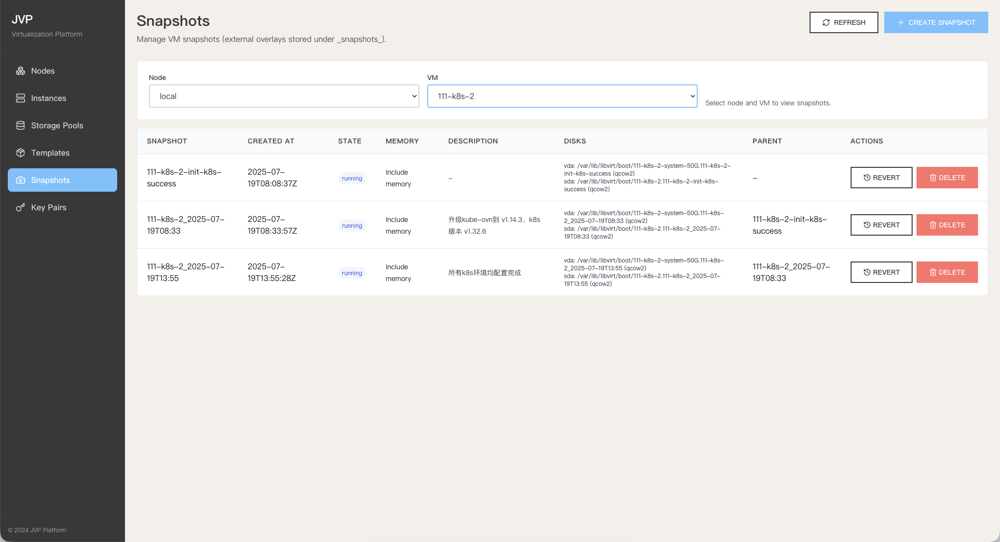

# JVP

jimyag's virtualization platform. jimyag 的虚拟化平台

[English](README_EN.md) | 中文

## 简介

JVP 是一个基于 QEMU/KVM 和 libvirt 的虚拟化平台，提供完整的虚拟机生命周期管理功能。支持通过 RESTful API 和现代化的 Web 管理界面创建、管理和监控虚拟机实例。










## 核心功能

### 实例管理（Instances）

- **创建实例**：自定义 CPU、内存、磁盘，支持桥接或 NAT 网络
  - 集成 cloud-init，支持用户数据与 SSH 公钥注入
- **查询实例**：按节点/ID 查询，返回网卡、MAC、IP、多 IP 信息、开机自启动标记、启动时间
- **生命周期管理**：启动、停止、重启、删除（可选同时删除卷）
- **修改实例属性**：调整 CPU、内存、名称、自动启动
- **密码重置**：基于 guest-agent 的异步重置（后台执行），保留 virt-customize 兜底
- **远程控制台**：支持 VNC/Serial 控制台

### 节点与存储

- **多节点管理**：支持同时管理多个 libvirt 节点（本地和远程），构建分布式虚拟化集群
  - **本地节点**：自动创建 `local (qemu:///system)` 节点
  - **远程节点**：通过 libvirt URI 添加远程节点（如 `qemu+ssh://user@host/system`）
  - **节点类型**：支持 compute（计算）、storage（存储）、hybrid（混合）等类型
  - **节点操作**：添加、删除、启用、禁用节点
- **节点概要**：查看每个节点的 CPU/内存/NUMA/虚拟化能力等硬件信息
- **存储池管理**：按节点管理存储池，列举/创建/启停/删除存储池，查看存储池使用情况
- **存储卷管理**：按节点和存储池列举卷，创建卷，查看卷详情（容量、分配、格式），删除卷

### 快照管理（Snapshots）

- **创建快照**：为虚拟机创建快照，支持包含内存状态
- **列举快照**：按节点和虚拟机查询快照列表
- **快照详情**：查看快照的详细信息（创建时间、状态、磁盘信息等）
- **回滚快照**：将虚拟机恢复到指定快照状态
- **删除快照**：删除不再需要的快照，释放存储空间
- **快照类型**：支持内部快照（qcow2）和外部快照（所有格式）

### 模板管理（Templates）

- **注册模板**：从 URL 下载云镜像或从本地文件导入
- **列举模板**：查看所有可用的虚拟机模板
- **模板详情**：查看模板的元数据（操作系统、大小、来源等）
- **删除模板**：删除不再使用的模板
- **模板类型**：支持云镜像模板（Ubuntu、Debian、Alpine 等）和快照导出的自定义模板

### 密钥对管理（KeyPairs）

- **创建密钥对**：支持 RSA 和 ED25519 算法
- **导入密钥对**：导入现有公钥
- **查询密钥对**：支持按 ID、名称等条件查询
- **删除密钥对**：删除不再使用的密钥对
- **自动注入**：创建实例时自动注入 SSH 公钥

### Web 管理界面

- **现代化 UI**：基于 React + Vite + Tailwind CSS 构建的响应式 Web 界面
- **实时监控**：查看实例状态、资源使用情况、网络信息等
- **远程控制台**：集成 VNC 和 Serial 控制台，支持图形和文本界面访问
- **统一管理**：通过 Web 界面管理所有资源（实例、节点、存储、模板、快照、密钥对）

## 环境要求

### 必需工具

| 工具                           | 用途                                       |
| ------------------------------ | ------------------------------------------ |
| **libvirt**                    | 虚拟化管理核心（libvirtd 守护进程）        |
| **virsh**                      | 执行 qemu-agent-command                    |
| **qemu-img**                   | 磁盘镜像操作（创建、调整大小、转换、快照） |
| **genisoimage** 或 **mkisofs** | 生成 cloud-init ISO                        |
| **ssh**                        | 远程节点连接（VNC/串口代理、文件传输）     |

### 可选工具

| 工具               | 用途                                         |
| ------------------ | -------------------------------------------- |
| **wget**           | 下载模板镜像（优先使用）                     |
| **curl**           | 下载模板镜像（wget 不可用时回退）            |
| **ip**             | 查询 ARP 邻居表获取 VM IP（优先使用）        |
| **arp**            | 查询 ARP 表获取 VM IP（ip 命令不可用时回退） |
| **virt-customize** | 重置虚拟机密码（兜底方案）                   |
| **socat**          | 远程节点 VNC/串口转发（远程节点上需要）      |

### 远程节点额外要求

如果使用远程 libvirt 节点（如 `qemu+ssh://user@host/system`），远程主机需要：

- **ssh** 服务
- **socat**（VNC/串口控制台）
- **genisoimage** 或 **mkisofs**（cloud-init ISO 生成）
- **find**, **cat**, **mkdir**, **rm**（基础 shell 命令）

### 安装命令

**Debian/Ubuntu:**

```bash
apt install libvirt-daemon-system qemu-utils genisoimage wget curl openssh-client libguestfs-tools socat
```

**RHEL/CentOS/Fedora:**

```bash
dnf install libvirt qemu-img genisoimage wget curl openssh-clients libguestfs-tools socat
```

## 如何使用

### 方式一：Docker 部署（推荐）

Docker 部署会在容器内运行 libvirtd，完全接管宿主机的虚拟化环境。

**1. 停止宿主机的 libvirt 服务**

```bash
sudo systemctl stop libvirtd libvirtd.socket virtlogd virtlogd.socket
sudo systemctl disable libvirtd libvirtd.socket virtlogd virtlogd.socket
```

**2. 创建数据目录**

```bash
sudo mkdir -p /var/lib/jvp
```

**3. 启动容器**

```bash
# 使用 docker-compose
docker compose up -d

# 或直接使用 docker run
docker run -d \
  --name jvp \
  --hostname jvp \
  --privileged \
  --network host \
  --cgroup host \
  --device /dev/kvm:/dev/kvm \
  --device /dev/net/tun:/dev/net/tun \
  --device /dev/vhost-net:/dev/vhost-net \
  -v /var/lib/libvirt:/var/lib/libvirt \
  -v /var/run/libvirt:/var/run/libvirt \
  -v /etc/libvirt:/etc/libvirt \
  -v /var/lib/jvp:/app/data \
  -e TZ=Asia/Shanghai \
  -e JVP_ADDRESS=0.0.0.0:7777 \
  -e JVP_DATA_DIR=/app/data \
  -e LIBVIRT_URI=qemu:///system \
  --restart unless-stopped \
  ghcr.io/jimyag/jvp:latest
```

**4. 访问 Web 界面**

```
http://<服务器IP>:7777
```

### 方式二：本地构建运行

**1. 构建项目**

```bash
# 构建包含前端的完整二进制文件
task build
```

**2. 运行服务**

```bash
# 运行 JVP 服务（默认端口 7777）
./bin/jvp
```

**3. 访问 Web 界面**

构建完成后，前端已嵌入到二进制文件中。启动服务后访问：

```
http://localhost:7777
```

### 本地调试（Docker）

```bash
# 构建本地调试镜像
task debug-image

# 修改 docker-compose.yml 中 image 为 jvp:local 后启动
docker compose up -d
```

## 未来计划

JVP 正在持续开发中，以下功能计划在未来版本中支持：

### 用户体验增强
- **国际化（i18n）**：支持多语言切换（中文、英文等）
- **深色/浅色主题切换**：支持主题切换和系统主题自动检测
- **用户引导**：首次使用引导、功能提示、快速开始向导

### 网络功能增强
- **多种网络配置**：桥接、NAT、虚拟网络、直通网络、VLAN、网络 QoS 等
- **网络隔离**：支持网络隔离和多网卡绑定

### 设备直通虚拟化
- **PCIe 设备直通**：GPU、网卡、NVMe 等 PCIe 设备直通
- **USB 设备直通**：USB 设备直通和热插拔支持
- **磁盘直通**：物理磁盘、分区、LVM 逻辑卷直通

### Windows 虚拟机支持
- **Windows 安装支持**：Windows ISO 镜像、VirtIO 驱动集成
- **Windows 优化配置**：CPU 模式优化、时钟同步、性能优化
- **Windows 工具集成**：QEMU Guest Agent、VirtIO 驱动自动安装

更多详细信息请参考 [实现计划](docs/implement/implementation-plan.md)。

## 相关资料

- <https://www.voidking.com/dev-libvirt-create-vm/>
- <https://sq.sf.163.com/blog/article/172808502565068800>
- <https://shihai1991.github.io/openstack/2024/02/20/%E9%80%9A%E8%BF%87libvirt%E5%88%9B%E5%BB%BA%E8%99%9A%E6%8B%9F%E6%9C%BA/>
- <https://www.baeldung.com/linux/qemu-uefi-boot> 启动 qemu 的 UEFI 引导
