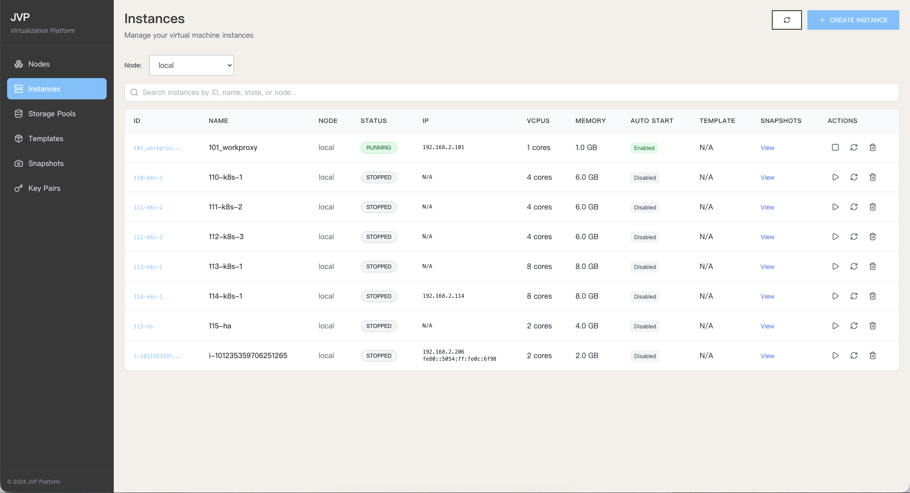
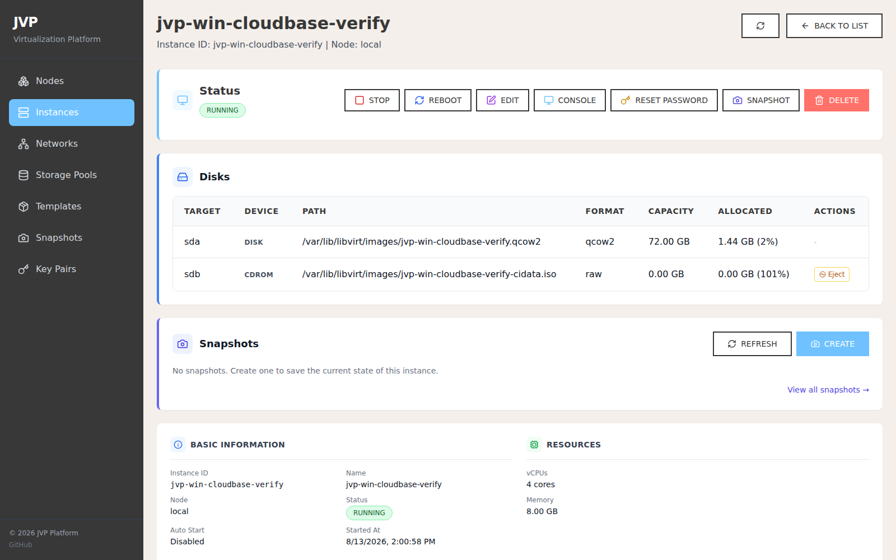

# JVP

jimyag's virtualization platform

English | [中文](README_CN.md)

## Introduction

JVP is a virtualization platform based on QEMU/KVM and libvirt, providing complete Linux and Windows virtual machine lifecycle management through a RESTful API and a modern web interface.

📖 **Documentation**: [https://jvp.jimyag.com](https://jvp.jimyag.com)



## Features

- **Instance Management** - Create, start, stop, snapshot VMs with cloud-init support
- **Windows Support** - Install from Windows ISOs with VirtIO drivers, or provision reusable Windows cloud images with Cloudbase-Init
- **Multi-Node Support** - Manage multiple libvirt nodes (local and remote)
- **Storage Management** - Manage storage pools and volumes
- **Snapshot & Template** - Create snapshots, register and manage VM templates
- **Modern Web UI** - React-based interface with VNC and Serial console

## Windows Virtual Machines

JVP supports two Windows provisioning workflows:

- **Install ISO** creates a blank disk, boots a Windows installer ISO, and optionally attaches a VirtIO driver ISO.
- **Cloud Image** clones a prepared Windows disk template and uses Cloudbase-Init with a NoCloud configuration drive for first-boot initialization.

Cloud Image mode lets you configure the hostname, timezone, administrator user and password, SSH public keys, and first-boot commands from the instance creation page. The template must contain Cloudbase-Init, VirtIO drivers, and QEMU Guest Agent, and must be registered with the `Cloud-init / Cloudbase-Init ready` and `VirtIO` features enabled.



## Quick Start

### Docker (Recommended)

```bash
# Stop host libvirt services
sudo systemctl stop libvirtd libvirtd.socket virtlogd virtlogd.socket
sudo systemctl disable libvirtd libvirtd.socket virtlogd virtlogd.socket

# Create data directory
sudo mkdir -p /var/lib/jvp

# Start container
docker compose up -d
```

Access: `http://<server-ip>:7777`

### Binary

Download from [GitHub Releases](https://github.com/jimyag/jvp/releases) and run:

```bash
./jvp
```

## Documentation

For detailed installation guides, feature documentation, and API reference, visit:

**[https://jvp.jimyag.com](https://jvp.jimyag.com)**

## License

[MIT](LICENSE)
