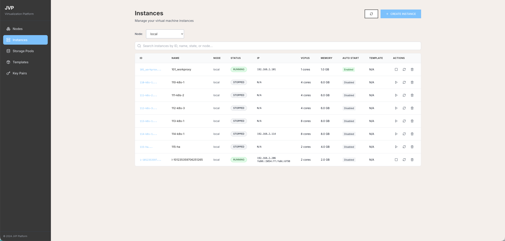
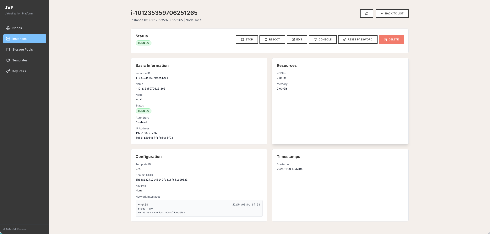
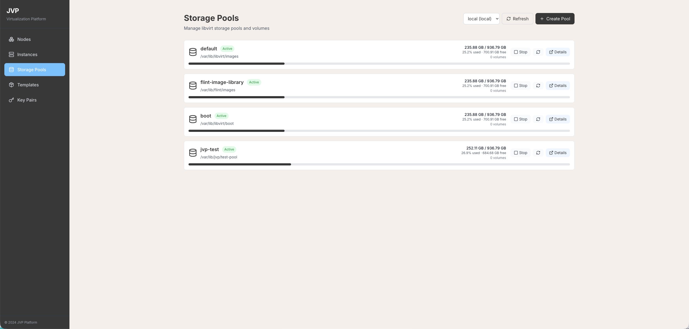
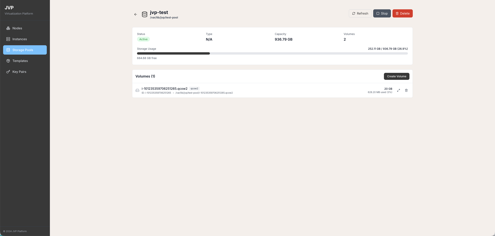
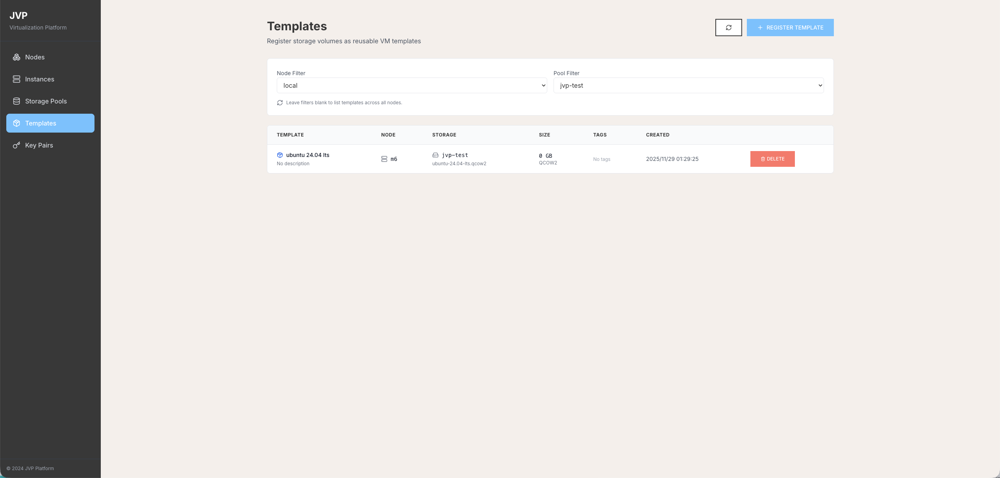
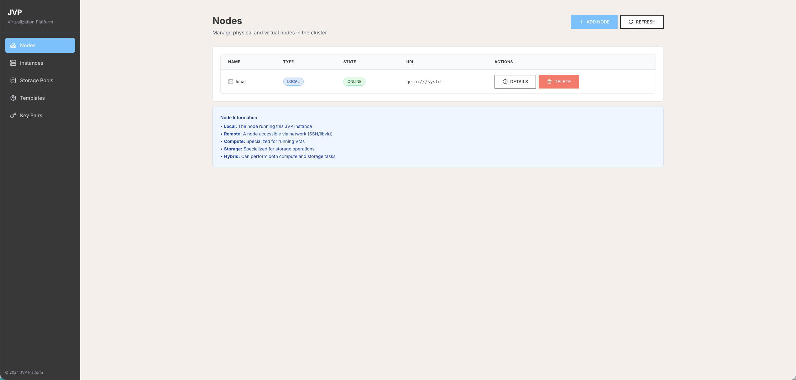
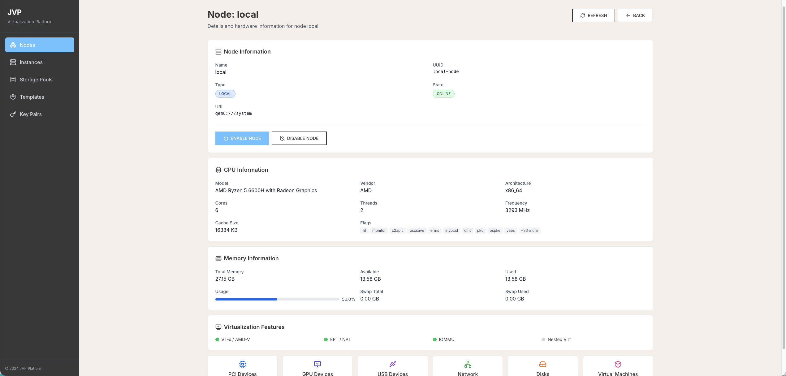
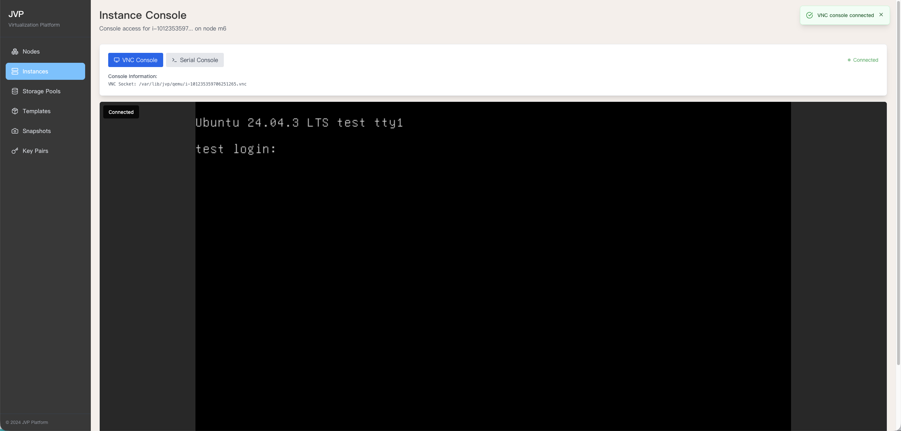
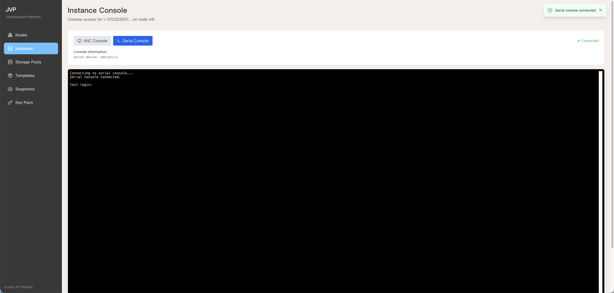

# JVP

jimyag's virtualization platform

[English](README_EN.md) | [中文](README.md)

## Introduction

JVP is a virtualization platform based on QEMU/KVM and libvirt, providing complete virtual machine lifecycle management. It supports creating, managing, and monitoring virtual machine instances through RESTful API and a modern web management interface.



















## Core Features

### Instance Management

- **Create Instances**: Customize CPU, memory, and disk, support bridge or NAT networking
  - Integrated cloud-init, supports user data and SSH public key injection
- **Query Instances**: Query by node/ID, returns network interfaces, MAC, IP, multiple IPs, autostart flag, start time
- **Lifecycle Management**: Start, stop, reboot, delete (optionally delete volumes)
- **Modify Instance Properties**: Adjust CPU, memory, name, autostart
- **Password Reset**: Asynchronous reset based on guest-agent (background execution), with virt-customize fallback
- **Remote Console**: Support VNC/Serial console

### Nodes and Storage

- **Multi-Node Management**: Support managing multiple libvirt nodes (local and remote) simultaneously, building distributed virtualization clusters
  - **Local Node**: Automatically creates `local (qemu:///system)` node
  - **Remote Nodes**: Add remote nodes via libvirt URI (e.g., `qemu+ssh://user@host/system`)
  - **Node Types**: Support compute, storage, hybrid, and other node types
  - **Node Operations**: Add, delete, enable, disable nodes
- **Node Summary**: View hardware information for each node (CPU/memory/NUMA/virtualization capabilities, etc.)
- **Storage Pool Management**: Manage storage pools by node, list/create/start/stop/delete storage pools, view storage pool usage
- **Storage Volume Management**: List volumes by node and storage pool, create volumes, view volume details (capacity, allocation, format), delete volumes

### Snapshot Management

- **Create Snapshots**: Create snapshots for virtual machines, support including memory state
- **List Snapshots**: Query snapshot list by node and virtual machine
- **Snapshot Details**: View detailed snapshot information (creation time, state, disk information, etc.)
- **Revert Snapshots**: Restore virtual machine to specified snapshot state
- **Delete Snapshots**: Delete snapshots that are no longer needed, free up storage space
- **Snapshot Types**: Support internal snapshots (qcow2) and external snapshots (all formats)

### Template Management

- **Register Templates**: Download cloud images from URL or import from local files
- **List Templates**: View all available virtual machine templates
- **Template Details**: View template metadata (operating system, size, source, etc.)
- **Delete Templates**: Delete templates that are no longer used
- **Template Types**: Support cloud image templates (Ubuntu, Debian, Alpine, etc.) and custom templates exported from snapshots

### Key Pair Management

- **Create Key Pairs**: Support RSA and ED25519 algorithms
- **Import Key Pairs**: Import existing public keys
- **Query Key Pairs**: Support querying by ID, name, etc.
- **Delete Key Pairs**: Delete key pairs that are no longer used
- **Auto Injection**: Automatically inject SSH public keys when creating instances

### Web Management Interface

- **Modern UI**: Responsive web interface built with React + Vite + Tailwind CSS
- **Real-time Monitoring**: View instance status, resource usage, network information, etc.
- **Remote Console**: Integrated VNC and Serial console, support graphical and text interface access
- **Unified Management**: Manage all resources (instances, nodes, storage, templates, snapshots, key pairs) through web interface

## How to Use

### Build Project

```bash
# Build complete binary file including frontend
task build
```

### Run Service

```bash
# Run JVP service (default port 7777)
./bin/jvp
```

### Access Web Interface

After building, the frontend is embedded in the binary file. After starting the service, access:

```bash
http://localhost:7777
```

## Related Resources

- <https://www.voidking.com/dev-libvirt-create-vm/>
- <https://sq.sf.163.com/blog/article/172808502565068800>
- <https://shihai1991.github.io/openstack/2024/02/20/%E9%80%9A%E8%BF%87libvirt%E5%88%9B%E5%BB%BA%E8%99%9A%E6%8B%9F%E6%9C%BA/>
- <https://www.baeldung.com/linux/qemu-uefi-boot> Boot qemu with UEFI

