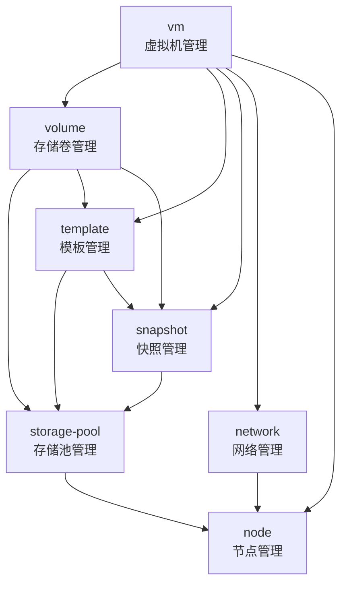

# JVP 架构设计概览

## 项目简介

JVP (Jimyag Virtual Platform) 是基于 libvirt 的轻量级虚拟化管理平台，提供简单易用的虚拟机管理能力。

## 模块概览

- vm: 虚拟机生命周期管理
- storage-pool: 存储池管理
- volume: 存储卷管理
- snapshot: 虚拟机快照管理
- template: 虚拟机模板管理
- network: 虚拟网络管理
- node: 物理节点管理

## 核心概念

### 虚拟机 (VM)

运行在虚拟化环境中的计算实例，拥有虚拟的 CPU、内存、磁盘和网络资源。每个虚拟机都是独立的，拥有自己的操作系统和应用程序。

### 存储池 (Storage Pool)

底层存储资源的容器，用于存储虚拟机磁盘、模板、快照等。存储池是物理存储资源的抽象，支持多种存储类型：

- dir: 本地目录存储，使用文件系统目录
- fs: 文件系统挂载点
- lvm: Linux 逻辑卷管理，支持快照和精简配置
- zfs: ZFS 存储池，支持压缩、去重和数据完整性保护
- rbd: Ceph 块设备，分布式存储

### 存储卷 (Volume)

存储在 Storage Pool 中的虚拟磁盘，可以附加到虚拟机作为数据盘使用。Volume 支持两种格式：

- qcow2: QEMU 的 Copy-on-Write 格式，支持快照、压缩、加密，动态分配空间
- raw: 原始磁盘格式，性能最好但不支持高级特性

### 快照 (Snapshot)

虚拟机某一时刻的完整状态，包括磁盘数据和可选的内存状态。快照可用于备份、恢复和创建新的虚拟机。快照支持增量存储，节省磁盘空间。

### 模板 (Template)

只读的虚拟机镜像，用于快速创建虚拟机。模板本质上是特殊的 Volume，存储在 Storage Pool 的 `_templates_` 目录下。模板有两种来源：

- Cloud Image: 官方云镜像（Ubuntu、Debian、Alpine 等）
- Snapshot: 用户自定义的虚拟机快照导出

### 网络 (Network)

虚拟网络，为虚拟机提供网络连接。支持多种网络类型：

- NAT: 网络地址转换，虚拟机可访问外网但外网无法直接访问
- Bridge: 桥接网络，虚拟机与宿主机在同一网段
- Isolated: 隔离网络，仅虚拟机间互通
- SR-IOV: 单根 I/O 虚拟化，硬件级高性能网络

### 节点 (Node)

运行 libvirtd 的物理主机，提供计算、存储、网络等物理资源。单机部署时只有一个本地节点，多节点部署时通过 libvirt URI 连接远程节点。

## 模块依赖关系



依赖说明：

- vm 是核心模块，协调其他模块完成虚拟机管理
- storage-pool 是底层存储资源，被 volume、template、snapshot 依赖
- volume、template、snapshot 都是存储层概念，存储在 storage-pool 中
- node 提供物理资源，被所有需要物理资源的模块依赖

## 设计原则

### 1. 单一职责

每个模块只负责一个清晰的领域，避免功能交叉和职责不清。例如 storage-pool 只管理存储池本身，池内的 volume 由 volume 模块管理。

### 2. 职责归属

功能归属遵循"用户视角"原则，将功能放在用户最常操作的地方：

- Volume 的附加/分离归属 VM 模块（用户操作虚拟机时附加卷）
- Snapshot 的创建归属 VM 模块（用户为虚拟机创建快照）
- Snapshot 的管理归属 Snapshot 模块（查询、删除、回滚、导出）

### 3. 层次清晰

资源层次明确，从底层到上层：

Node → Storage Pool → Volume/Template/Snapshot → VM

底层资源为上层提供支持，上层不直接操作底层细节。

### 4. 依赖最小化

模块间通过清晰接口交互，避免循环依赖。底层模块不依赖上层模块，保持架构的稳定性和可扩展性。

## API 设计

### API 风格

采用 AWS 风格的 Action API，所有接口使用 POST 方法，操作名称作为路径：

```
POST /api/create-vm
POST /api/start-vm
POST /api/list-vms
POST /api/describe-vm
```

这种风格的优势：

- 语义清晰：一眼就知道要执行什么操作
- 简单统一：不需要纠结 HTTP 方法的语义
- 灵活扩展：复杂操作不需要费心设计路径
- 更适合 RPC：虚拟化管理本质是远程过程调用

### 命名规范

操作命名遵循以下规则：

- create-*: 创建资源
- delete-*: 删除资源
- list-*: 列举资源
- describe-*: 查询资源详情
- modify-*: 修改资源配置
- start/stop/reboot: 资源状态控制
- attach/detach: 资源关联操作

## 数据存储策略

所有状态存储在 libvirt XML 配置中，部分内容存储在 node 本地的文件中。

优点：
- 简单，不需要额外的数据库
- 与 libvirt 紧密集成

缺点：
- 查询性能较差
- 不支持复杂查询和索引

适用场景：单机、小规模部署（<50 虚拟机）

## 扩展性考虑

后续计划支持的功能：

- 虚拟机迁移：在节点间迁移虚拟机（Live Migration）
- 高可用：虚拟机自动故障转移
- 资源调度：根据节点负载自动选择最优节点
- 监控告警：资源使用监控和告警通知
- 日志审计：操作日志记录和审计

## 架构总结

JVP 架构设计遵循以下核心思想：

1. 以虚拟机为中心：VM 是用户交互的主要入口
2. 存储层次清晰：pool → volume/template/snapshot → vm
3. 职责单一明确：每个模块只做一件事
4. 支持集群扩展：通过 node 模块支持多节点部署
5. 灵活可扩展：模块间低耦合，易于扩展新功能
